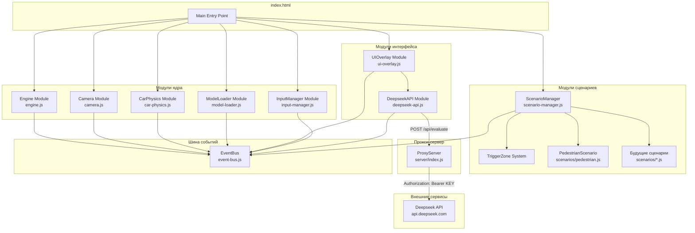
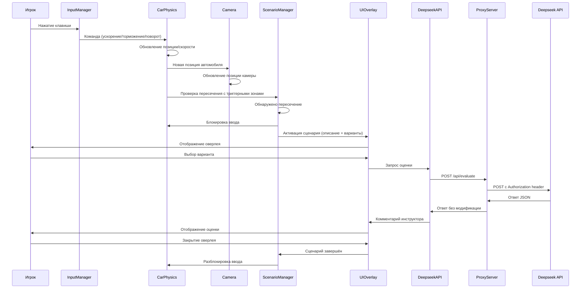
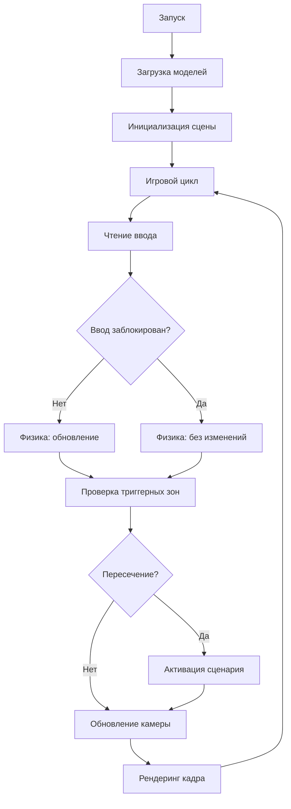
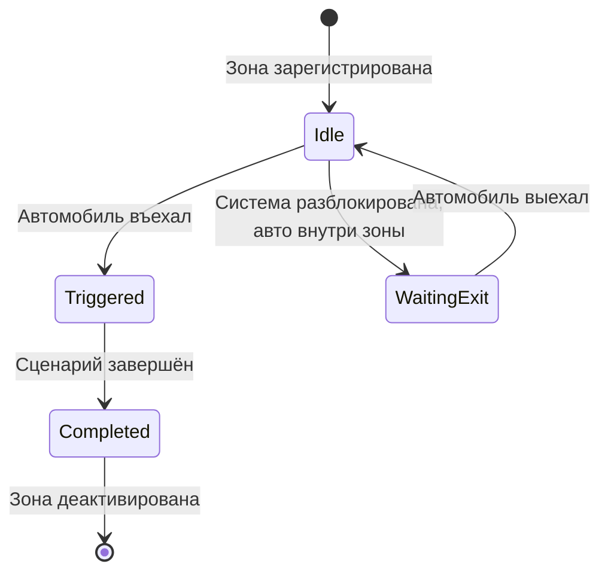
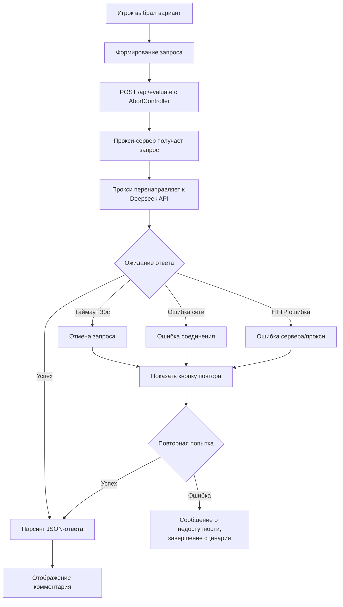
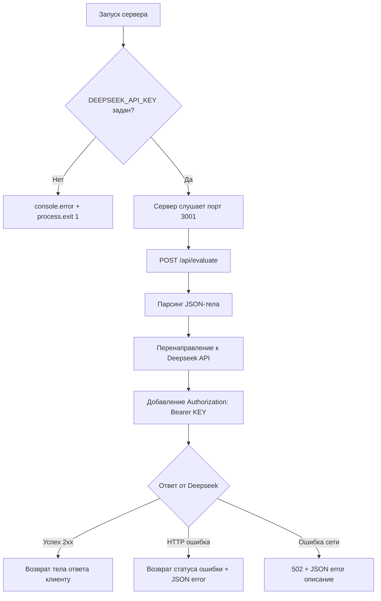

# Документ проектирования: Симуляция вождения

## Overview

Браузерная симуляция вождения от первого лица, реализованная как единый `index.html` с модульной архитектурой на ES-модулях. Babylon.js загружается из CDN, 3D-модели в формате GLTF — из локальной директории `/assets`. Система построена на событийной модели: триггерные зоны активируют сценарии, UI-оверлей отображает выбор, а Deepseek API оценивает решения игрока.

### Ключевые проектные решения

1. **Единый HTML-файл как точка входа** — без сборки, без npm, запуск через локальный HTTP-сервер
2. **ES-модули в браузере** — каждый модуль в отдельном `.js` файле, подключение через `type="module"`
3. **Babylon.js из CDN** — минимальная конфигурация, быстрый старт
4. **Событийная архитектура** — модули общаются через центральный EventBus, минимизируя связность
5. **Модульные сценарии** — каждый сценарий в отдельном файле с единым интерфейсом, регистрация через ScenarioManager

### Структура проекта

```
project/
├── index.html              # Единая точка входа
├── README.md               # Инструкции по запуску проекта
├── js/
│   ├── event-bus.js        # Шина событий
│   ├── engine.js           # Инициализация Babylon.js
│   ├── camera.js           # Камера от первого лица
│   ├── car-physics.js      # Физика автомобиля
│   ├── input-manager.js    # Обработка ввода
│   ├── model-loader.js     # Загрузка GLTF-моделей
│   ├── scenario-manager.js # Управление сценариями
│   ├── ui-overlay.js       # UI-оверлей
│   ├── deepseek-api.js     # Интеграция с API (через локальный прокси)
│   └── scenarios/
│       └── pedestrian.js   # Сценарий «Пешеход»
├── server/
│   └── index.js            # Express.js прокси-сервер для Deepseek API
└── assets/
    ├── models/
    │   ├── car.gltf
    │   ├── pedestrian.gltf
    │   ├── traffic-light.gltf
    │   └── building.gltf
    └── textures/
        ├── T_Concrete_Asphalt_BaseColor.png  # Текстура дороги
        ├── T_Concrete_BaseColor.png          # Текстура тротуара
        └── ... (другие текстуры)
```

## Architecture

### Диаграмма компонентов



### Диаграмма потока данных



### Игровой цикл



### Механизм обнаружения триггерных зон

Обнаружение пересечения автомобиля с триггерной зоной реализуется через Babylon.js bounding boxes:

1. **Bounding Box автомобиля** — вычисляется из меша автомобиля через `mesh.getBoundingInfo().boundingBox`
2. **Bounding Box триггерной зоны** — создаётся невидимый меш (`isVisible = false`) с размерами, определяемыми `radius` сценария
3. **Проверка пересечения** — каждый кадр вызывается `BABYLON.BoundingBox.Intersects(carBB, triggerBB)` для всех активных зон
4. **Оптимизация** — проверка выполняется только для зон в радиусе 100м от автомобиля (предварительная фильтрация по расстоянию)

```javascript
// Логика проверки пересечения
function checkTriggerIntersection(carMesh, triggerZones) {
    const carBB = carMesh.getBoundingInfo().boundingBox;
    for (const zone of triggerZones) {
        if (!zone.isActive || zone.wasTriggered) continue;
        const distance = Vector3.Distance(carMesh.position, zone.mesh.position);
        if (distance > 100) continue; // Предварительная фильтрация
        const zoneBB = zone.mesh.getBoundingInfo().boundingBox;
        if (carBB.intersectsMinMax(zoneBB.minimumWorld, zoneBB.maximumWorld)) {
            return zone;
        }
    }
    return null;
}
```

### Логика re-entry (повторного въезда)

Для предотвращения ложной активации при разблокировке системы, когда автомобиль уже внутри зоны:



## Components and Interfaces

### 1. EventBus (`event-bus.js`)

Центральная шина событий для слабосвязанного взаимодействия модулей.

```javascript
// event-bus.js
export const EventBus = {
    _listeners: {},
    on(event, callback) {},
    off(event, callback) {},
    emit(event, data) {}
};
```

**События системы:**
| Событие | Данные | Описание |
|---------|--------|----------|
| `models:loaded` | `void` | Все модели загружены |
| `models:error` | `{ filename: string, error: Error }` | Ошибка загрузки модели |
| `car:positionUpdate` | `{ position: Vector3, rotation: number }` | Позиция автомобиля обновлена |
| `trigger:entered` | `{ scenarioId: string }` | Автомобиль въехал в триггерную зону |
| `scenario:activated` | `{ scenario: ScenarioData }` | Сценарий активирован |
| `scenario:choiceMade` | `{ scenarioId: string, choiceIndex: number }` | Игрок сделал выбор |
| `scenario:completed` | `{ scenarioId: string }` | Сценарий завершён |
| `input:blocked` | `void` | Ввод заблокирован |
| `input:unblocked` | `void` | Ввод разблокирован |
| `api:response` | `{ text: string }` | Ответ от Deepseek API |
| `api:error` | `{ error: string, canRetry: boolean }` | Ошибка API |

### 2. Engine Module (`engine.js`)

Инициализация Babylon.js, создание сцены и управление игровым циклом.

```javascript
// engine.js
export class Engine {
    constructor(canvasId) {}
    async initialize() {}  // Создание BabylonEngine, Scene
    registerUpdateCallback(fn) {}  // Регистрация функции обновления в render loop
    start() {}  // Запуск render loop
    getScene() {}  // Доступ к сцене Babylon.js
}
```

### 3. Camera Module (`camera.js`)

Камера от первого лица, привязанная к позиции водителя.

```javascript
// camera.js
export class DriverCamera {
    constructor(scene, offset) {}  // offset: {x, y, z} смещение от центра авто
    attachToCar(carMesh) {}
    update(carPosition, carRotation) {}  // Вызывается каждый кадр
    getCamera() {}  // Возвращает Babylon.js UniversalCamera
}
```

**Параметры:**
- FOV: 70° (вертикальный)
- Смещение от центра авто: `{ x: -0.3, y: 1.2, z: 0.5 }` (позиция водителя)
- Направление: фиксировано вперёд по направлению движения авто
- Свободное вращение камеры отключено

### 4. CarPhysics Module (`car-physics.js`)

Физическая модель автомобиля на плоской поверхности.

```javascript
// car-physics.js
export class CarPhysics {
    constructor(config) {}
    update(deltaTime, input) {}  // Обновление физики за кадр
    getPosition() {}  // Vector3
    getRotation() {}  // number (радианы)
    getSpeed() {}  // number (м/с)
    getBoundingBox() {}  // BoundingBox
    setInputBlocked(blocked) {}
    forceStop(duration) {}  // Плавная остановка за duration секунд
}
```

**Конфигурация физики:**
```javascript
const PHYSICS_CONFIG = {
    maxSpeed: 33.33,        // 120 км/ч в м/с
    acceleration: 2.0,      // м/с²
    brakeDeceleration: 4.0, // м/с²
    friction: 0.5,          // м/с² (замедление без газа)
    minTurnRate: 0,         // град/с при скорости 0
    maxTurnRate: 90,        // град/с при максимальной скорости
};
```

**Алгоритм обновления физики:**
```javascript
update(deltaTime, input) {
    if (this.inputBlocked) return;
    
    // Ускорение / торможение
    if (input.accelerate) {
        this.speed = Math.min(this.speed + this.config.acceleration * deltaTime, this.config.maxSpeed);
    } else if (input.brake) {
        this.speed = Math.max(this.speed - this.config.brakeDeceleration * deltaTime, 0);
    } else {
        this.speed = Math.max(this.speed - this.config.friction * deltaTime, 0);
    }
    
    // Поворот (только при движении)
    if (this.speed > 0) {
        const turnFactor = this.speed / this.config.maxSpeed;
        const turnRate = this.config.maxTurnRate * turnFactor * (Math.PI / 180);
        if (input.turnLeft) this.rotation -= turnRate * deltaTime;
        if (input.turnRight) this.rotation += turnRate * deltaTime;
    }
    
    // Обновление позиции
    this.position.x += Math.sin(this.rotation) * this.speed * deltaTime;
    this.position.z += Math.cos(this.rotation) * this.speed * deltaTime;
}
```

### 5. InputManager (`input-manager.js`)

Обработка клавиатурного ввода.

```javascript
// input-manager.js
export class InputManager {
    constructor() {}
    getInput() {}  // { accelerate: bool, brake: bool, turnLeft: bool, turnRight: bool }
    setBlocked(blocked) {}
    isBlocked() {}
}
```

**Раскладка клавиш:**
| Клавиша | Действие |
|---------|----------|
| W / ↑ | Ускорение |
| S / ↓ | Торможение |
| A / ← | Поворот влево |
| D / → | Поворот вправо |

### 6. ModelLoader (`model-loader.js`)

Загрузка и размещение GLTF-моделей, а также загрузка и применение текстур.

```javascript
// model-loader.js
export class ModelLoader {
    constructor(scene, modelsPath, texturesPath) {}
    async loadAll(manifest, timeout) {}  // Загрузка всех моделей и текстур с таймаутом
    async loadTextures(textureManifest) {}  // Загрузка текстур из /assets/textures/
    getModel(name) {}  // Получение загруженной модели по имени
    getTexture(name) {}  // Получение загруженной текстуры по имени
    placeBuildings(buildingMesh, roadConfig) {}  // Размещение зданий вдоль дороги
    createRoadPlane(scene, texturePath) {}  // Создание плоскости дороги с тайлинговой текстурой
    createSidewalkPlane(scene, texturePath) {}  // Создание плоскости тротуара с тайлинговой текстурой
}
```

**Манифест моделей:**
```javascript
const MODEL_MANIFEST = [
    { name: 'car', file: 'car.gltf' },
    { name: 'pedestrian', file: 'pedestrian.gltf' },
    { name: 'trafficLight', file: 'traffic-light.gltf' },
    { name: 'building', file: 'building.gltf' },
];
```

**Манифест текстур:**
```javascript
const TEXTURE_MANIFEST = [
    { name: 'road', file: 'T_Concrete_Asphalt_BaseColor.png' },
    { name: 'sidewalk', file: 'T_Concrete_BaseColor.png' },
];
```

**Создание плоскостей дороги и тротуаров с тайлинговыми текстурами:**
```javascript
createRoadPlane(scene, texturePath) {
    const roadPlane = BABYLON.MeshBuilder.CreateGround('road', { width: 10, height: 500 }, scene);
    const roadMaterial = new BABYLON.StandardMaterial('roadMat', scene);
    roadMaterial.diffuseTexture = new BABYLON.Texture(texturePath, scene);
    roadMaterial.diffuseTexture.uScale = 20;
    roadMaterial.diffuseTexture.vScale = 20;
    roadPlane.material = roadMaterial;
    return roadPlane;
}

createSidewalkPlane(scene, texturePath) {
    const sidewalkPlane = BABYLON.MeshBuilder.CreateGround('sidewalk', { width: 4, height: 500 }, scene);
    const sidewalkMaterial = new BABYLON.StandardMaterial('sidewalkMat', scene);
    sidewalkMaterial.diffuseTexture = new BABYLON.Texture(texturePath, scene);
    sidewalkMaterial.diffuseTexture.uScale = 20;
    sidewalkMaterial.diffuseTexture.vScale = 20;
    sidewalkPlane.material = sidewalkMaterial;
    return sidewalkPlane;
}
```

**Логика размещения зданий:**
- Минимум 4 здания на каждой стороне дороги
- Равномерный интервал между зданиями
- Размещение по оси X (слева/справа от дороги) с фиксированным отступом

### 7. ScenarioManager (`scenario-manager.js`)

Управление жизненным циклом сценариев и триггерных зон.

```javascript
// scenario-manager.js
export class ScenarioManager {
    constructor(eventBus) {}
    register(scenario) {}  // Регистрация сценария с валидацией
    update(carBoundingBox) {}  // Проверка пересечений каждый кадр
    getActiveScenario() {}  // Текущий активный сценарий или null
    completeScenario(scenarioId) {}  // Завершение сценария
    isLocked() {}  // Заблокирована ли система
}
```

**Валидация при регистрации:**
- Проверка наличия обязательных свойств: `id`, `description`, `choices`, `position`, `radius`, `activate`
- Проверка типов: `choices` — массив из 2-3 элементов, `radius` — положительное число
- При отсутствии — ошибка в консоль с указанием отсутствующих свойств, регистрация отклоняется

### 8. UIOverlay (`ui-overlay.js`)

HTML/CSS оверлей поверх canvas.

```javascript
// ui-overlay.js
export class UIOverlay {
    constructor(containerId, eventBus) {}
    showScenario(description, choices) {}  // Отображение сценария
    showLoading() {}  // Анимированный индикатор загрузки
    showResponse(text) {}  // Комментарий инструктора + кнопка закрытия
    showError(message, canRetry) {}  // Ошибка с кнопкой повтора
    hide() {}  // Скрытие оверлея
    onChoice(callback) {}  // Обработчик выбора
    onClose(callback) {}  // Обработчик закрытия
    onRetry(callback) {}  // Обработчик повтора
}
```

### 9. DeepseekAPI (`deepseek-api.js`)

Интеграция с Deepseek API через локальный прокси-сервер.

```javascript
// deepseek-api.js
export class DeepseekAPI {
    constructor(config) {}
    async evaluate(scenarioDescription, playerChoice) {}  // Отправка запроса к /api/evaluate
    abort() {}  // Отмена текущего запроса через AbortController
}
```

**Конфигурация:**
```javascript
const API_CONFIG = {
    endpoint: '/api/evaluate',   // Локальный прокси-сервер
    timeout: 30000,              // 30 секунд
    maxRetries: 1,               // Одна повторная попытка
    systemPrompt: 'Вы — опытный инструктор по вождению. Оцените выбор ученика с точки зрения безопасности дорожного движения. Дайте краткий, конструктивный комментарий.'
};
```

**Поток запроса:**


### 10. Модуль сценария — Пешеход (`scenarios/pedestrian.js`)

```javascript
// scenarios/pedestrian.js
export const PedestrianScenario = {
    id: 'pedestrian-crossing',
    description: 'Впереди на пешеходном переходе человек упал и не может встать. До него 20-30 метров.',
    choices: [
        'Остановиться и ждать',
        'Посигналить и объехать',
        'Вызвать экстренные службы'
    ],
    position: { x: 0, z: 100 },  // Координаты триггерной зоны
    radius: 15,  // Радиус активации
    activate(scene, eventBus) {
        // 1. Показать модель пешехода на расстоянии 20-30м впереди
        // 2. Запустить анимацию падения
        // 3. Автоматическая остановка автомобиля (forceStop, 2 секунды)
    },
    deactivate(scene) {
        // Скрыть модель пешехода
    }
};
```

### 11. ProxyServer (`server/index.js`)

Express.js прокси-сервер для безопасного взаимодействия с Deepseek API. API-ключ хранится на сервере в переменной окружения, а не в клиентском коде.

```javascript
// server/index.js
const express = require('express');
const cors = require('cors');

const app = express();
const PORT = process.env.PORT || 3001;
const DEEPSEEK_API_KEY = process.env.DEEPSEEK_API_KEY;

// Валидация ключа при запуске
if (!DEEPSEEK_API_KEY) {
    console.error('ОШИБКА: Переменная окружения DEEPSEEK_API_KEY не задана.');
    process.exit(1);
}

// Middleware
app.use(cors());           // CORS для локального фронтенда
app.use(express.json());   // Парсинг JSON-тела запроса

// POST /api/evaluate — проксирование к Deepseek API
app.post('/api/evaluate', async (req, res) => {
    try {
        const response = await fetch('https://api.deepseek.com/v1/chat/completions', {
            method: 'POST',
            headers: {
                'Content-Type': 'application/json',
                'Authorization': `Bearer ${DEEPSEEK_API_KEY}`
            },
            body: JSON.stringify(req.body)
        });

        if (!response.ok) {
            return res.status(response.status).json({
                error: `Deepseek API error: ${response.statusText}`
            });
        }

        const data = await response.json();
        res.json(data);
    } catch (error) {
        res.status(502).json({
            error: `Proxy error: ${error.message}`
        });
    }
});

app.listen(PORT, () => {
    console.log(`Proxy server running on port ${PORT}`);
});
```

**Конфигурация:**
```javascript
const PROXY_CONFIG = {
    port: 3001,                    // Порт по умолчанию
    deepseekEndpoint: 'https://api.deepseek.com/v1/chat/completions',
    envKeyName: 'DEEPSEEK_API_KEY' // Имя переменной окружения
};
```

**Поток обработки запроса:**


**Зависимости сервера:**
- `express` — HTTP-фреймворк
- `cors` — CORS middleware
- Node.js встроенный `fetch` (Node 18+) или `node-fetch`

## Data Models

### ScenarioDefinition (Интерфейс сценария)

```typescript
interface ScenarioDefinition {
    id: string;                    // Уникальный идентификатор
    description: string;           // Описание ситуации (до 300 символов)
    choices: string[];             // Варианты действий (2-3 элемента)
    position: { x: number; z: number };  // Позиция триггерной зоны
    radius: number;                // Радиус активации (метры)
    activate: (scene: Scene, eventBus: EventBus) => void;  // Функция активации
    deactivate?: (scene: Scene) => void;  // Функция деактивации (опционально)
}
```

### TriggerZone (Состояние триггерной зоны)

```typescript
interface TriggerZone {
    scenarioId: string;            // Привязанный сценарий
    position: { x: number; z: number };  // Центр зоны
    radius: number;                // Радиус
    mesh: BABYLON.Mesh;            // Невидимый меш для bounding box
    isActive: boolean;             // Может ли быть активирована
    wasTriggered: boolean;         // Была ли уже активирована
    carInside: boolean;            // Автомобиль внутри зоны (для re-entry логики)
}
```

### CarState (Состояние автомобиля)

```typescript
interface CarState {
    position: { x: number; y: number; z: number };  // Позиция в мире
    rotation: number;              // Угол поворота (радианы)
    speed: number;                 // Текущая скорость (м/с)
    inputBlocked: boolean;         // Заблокирован ли ввод
    isForceStopping: boolean;      // В процессе принудительной остановки
}
```

### InputState (Состояние ввода)

```typescript
interface InputState {
    accelerate: boolean;
    brake: boolean;
    turnLeft: boolean;
    turnRight: boolean;
}
```

### APIRequest (Запрос к /api/evaluate)

```typescript
interface APIRequest {
    model: string;
    messages: [
        { role: 'system'; content: string },
        { role: 'user'; content: string }
    ];
    max_tokens: number;
    temperature: number;
}
```

### APIResponse (Ответ от /api/evaluate через прокси)

```typescript
interface APIResponse {
    choices: [{
        message: {
            content: string;  // Текст комментария инструктора
        }
    }];
}
```

### APIErrorResponse (Ответ ошибки от прокси-сервера)

```typescript
interface APIErrorResponse {
    error: string;  // Описание ошибки
}
```

### UIState (Состояние UI-оверлея)

```typescript
type UIState = 
    | { type: 'hidden' }
    | { type: 'scenario'; description: string; choices: string[] }
    | { type: 'loading' }
    | { type: 'response'; text: string }
    | { type: 'error'; message: string; canRetry: boolean };
```

### PhysicsConfig (Конфигурация физики)

```typescript
interface PhysicsConfig {
    maxSpeed: number;          // Максимальная скорость (м/с)
    acceleration: number;      // Ускорение (м/с²)
    brakeDeceleration: number; // Торможение (м/с²)
    friction: number;          // Трение (м/с²)
    maxTurnRate: number;       // Максимальная скорость поворота (град/с)
}
```

### ModelManifestEntry (Запись манифеста моделей)

```typescript
interface ModelManifestEntry {
    name: string;    // Идентификатор модели
    file: string;    // Имя файла в /assets/models/ (формат .gltf)
}

// Примеры:
// { name: 'car', file: 'car.gltf' }
// { name: 'building', file: 'building.gltf' }
```

### TextureManifestEntry (Запись манифеста текстур)

```typescript
interface TextureManifestEntry {
    name: string;    // Идентификатор текстуры (например, 'road', 'sidewalk')
    file: string;    // Имя файла в /assets/textures/ (формат .png)
}

// Примеры:
// { name: 'road', file: 'T_Concrete_Asphalt_BaseColor.png' }
// { name: 'sidewalk', file: 'T_Concrete_BaseColor.png' }
```


## Correctness Properties

*Свойство (property) — это характеристика или поведение, которое должно оставаться истинным при всех допустимых выполнениях системы. По сути, это формальное утверждение о том, что система должна делать. Свойства служат мостом между человекочитаемыми спецификациями и машинно-верифицируемыми гарантиями корректности.*

### Property 1: Камера сохраняет фиксированное преобразование относительно автомобиля

*Для любой* позиции и ориентации автомобиля, после вызова update() камера должна находиться на фиксированном смещении от центра автомобиля и иметь фиксированную ориентацию относительно направления движения авто, без возможности свободного вращения пользователем.

**Validates: Requirements 1.2, 1.4**

### Property 2: Ускорение ограничено максимальной скоростью

*Для любой* начальной скорости в диапазоне [0, maxSpeed] и любого положительного deltaTime, при нажатии клавиши ускорения новая скорость должна быть равна min(speed + acceleration * deltaTime, maxSpeed) и никогда не превышать maxSpeed (33.33 м/с).

**Validates: Requirements 2.1**

### Property 3: Торможение уменьшает скорость до нуля

*Для любой* начальной скорости > 0 и любого положительного deltaTime, при нажатии клавиши торможения новая скорость должна быть равна max(speed - brakeDeceleration * deltaTime, 0) и никогда не опускаться ниже нуля.

**Validates: Requirements 2.2**

### Property 4: Скорость неотрицательна с учётом трения

*Для любой* начальной скорости >= 0 и любого положительного deltaTime, после обновления физики без ввода ускорения или торможения, скорость должна уменьшиться на friction * deltaTime, но никогда не опуститься ниже нуля. Инвариант speed >= 0 должен выполняться при любой комбинации ввода.

**Validates: Requirements 2.4, 2.7**

### Property 5: Скорость поворота пропорциональна скорости движения и равна нулю при остановке

*Для любой* скорости движения v в диапазоне [0, maxSpeed], скорость поворота должна быть равна maxTurnRate * (v / maxSpeed), находиться в диапазоне [0, 90] град/с, и при v = 0 ввод поворота должен полностью игнорироваться (угол направления не изменяется).

**Validates: Requirements 2.3, 2.5**

### Property 6: Движение ограничено плоской поверхностью

*Для любой* последовательности обновлений физики с произвольным вводом, y-координата позиции автомобиля должна всегда оставаться равной уровню дороги (y = 0).

**Validates: Requirements 2.6**

### Property 7: Размещение зданий вдоль дороги

*Для любой* конфигурации дороги, функция placeBuildings() должна размещать не менее 4 зданий на каждой стороне дороги с равномерным интервалом между ними.

**Validates: Requirements 3.4**

### Property 8: Регистрация создаёт триггерную зону для каждого сценария

*Для любого* валидного объекта ScenarioDefinition, после вызова register() должна быть создана ровно одна TriggerZone с правильным scenarioId, позицией и радиусом, соответствующими переданному сценарию.

**Validates: Requirements 4.1**

### Property 9: Пересечение bounding box активирует сценарий

*Для любой* позиции автомобиля, если bounding box автомобиля пересекается с bounding box активной триггерной зоны и система не заблокирована, то связанный сценарий должен быть активирован.

**Validates: Requirements 4.2**

### Property 10: Блокировка системы при активном сценарии

*Для любого* активного сценария и любой позиции автомобиля внутри другой триггерной зоны, система должна игнорировать пересечение и не активировать дополнительные сценарии до завершения текущего.

**Validates: Requirements 4.3**

### Property 11: Деактивация триггерной зоны после завершения сценария

*Для любой* триггерной зоны, после завершения связанного сценария, зона должна быть помечена как wasTriggered = true и повторное пересечение автомобиля с этой зоной не должно вызывать повторную активацию сценария.

**Validates: Requirements 4.6**

### Property 12: Логика повторного въезда (re-entry)

*Для любой* триггерной зоны, если автомобиль находится внутри зоны в момент разблокировки системы после завершения предыдущего сценария, активация должна произойти только после полного выезда автомобиля из зоны и последующего повторного въезда.

**Validates: Requirements 4.7**

### Property 13: Блокировка ввода при видимом UI-оверлее

*Для любого* состояния UI-оверлея, отличного от 'hidden', ввод с клавиатуры для управления автомобилем должен быть заблокирован и игнорироваться физическим модулем.

**Validates: Requirements 5.3**

### Property 14: Ограничение длины ответа API

*Для любого* ответа от Deepseek API произвольной длины, отображаемый текст комментария инструктора не должен превышать 2000 символов.

**Validates: Requirements 6.2**

### Property 15: Успешная регистрация валидных сценариев

*Для любого* объекта, содержащего все обязательные свойства интерфейса ScenarioDefinition (id, description, choices, position, radius, activate) с корректными типами, вызов register() должен успешно добавить сценарий в список без ошибок.

**Validates: Requirements 8.1**

### Property 16: Отклонение регистрации невалидных сценариев

*Для любого* объекта, в котором отсутствует хотя бы одно обязательное свойство интерфейса ScenarioDefinition, вызов register() должен отклонить регистрацию и вывести в консоль сообщение об ошибке с указанием всех отсутствующих свойств.

**Validates: Requirements 8.4**

### Property 17: Прокси перенаправляет запросы с заголовком авторизации

*Для любого* валидного JSON-тела запроса, содержащего описание сценария и выбор игрока, прокси-сервер должен перенаправить запрос к Deepseek API, добавив заголовок `Authorization: Bearer <DEEPSEEK_API_KEY>` из переменной окружения.

**Validates: Requirements 10.2, 10.4**

### Property 18: Прокси возвращает ответ без модификации

*Для любого* успешного ответа от Deepseek API произвольной структуры, прокси-сервер должен вернуть тело ответа клиенту без изменений (pass-through).

**Validates: Requirements 10.5**

### Property 19: Прокси возвращает ошибку при сбое Deepseek API

*Для любого* HTTP-ответа с кодом ошибки (4xx, 5xx) от Deepseek API, прокси-сервер должен вернуть клиенту HTTP-статус ошибки и JSON-объект с полем `error`, содержащим описание ошибки.

**Validates: Requirements 10.7**

### Property 20: CORS-заголовки присутствуют в ответах прокси

*Для любого* запроса к прокси-серверу, ответ должен содержать CORS-заголовки (Access-Control-Allow-Origin), разрешающие запросы с локального HTTP-сервера фронтенда.

**Validates: Requirements 10.9**

### Property 21: Фронтенд отправляет запросы к локальному /api/evaluate

*Для любого* сценария и выбора игрока, модуль DeepseekAPI должен отправлять POST-запрос к эндпоинту `/api/evaluate` (а не напрямую к Deepseek API), передавая описание сценария и текст выбранного действия в теле запроса.

**Validates: Requirements 6.1**

### Property 22: Тайлинговые текстуры дороги и тротуаров

*Для любой* плоскости дороги или тротуара, созданной через createRoadPlane() или createSidewalkPlane(), материал должен быть типа StandardMaterial, а его diffuseTexture должна иметь параметры uScale = 20 и vScale = 20 для корректного тайлинга текстуры.

**Validates: Requirements 3.7**

## Error Handling

### Ошибки загрузки моделей

| Ситуация | Действие |
|----------|----------|
| Файл модели не найден | Вывод ошибки в консоль с именем файла, прерывание запуска |
| Таймаут загрузки (>30с) | Отмена всех загрузок, вывод ошибки таймаута, прерывание запуска |
| Некорректный формат GLTF | Вывод ошибки парсинга в консоль, прерывание запуска |

### Ошибки Deepseek API

| Ситуация | Действие |
|----------|----------|
| Ошибка сети (fetch rejected) | UI показывает сообщение об ошибке + кнопка повтора |
| HTTP-статус ошибки (4xx, 5xx) | UI показывает сообщение об ошибке + кнопка повтора |
| Таймаут (>30с) | Отмена запроса через AbortController, UI показывает таймаут + кнопка повтора |
| Повторная ошибка после retry | UI показывает «Сервис недоступен», сценарий завершается, управление возвращается игроку |
| Некорректный JSON в ответе | Обработка как ошибка сети, кнопка повтора |

### Ошибки прокси-сервера

| Ситуация | Действие |
|----------|----------|
| DEEPSEEK_API_KEY не задан при запуске | console.error с описанием проблемы, process.exit(1) |
| Ошибка сети при обращении к Deepseek API | Возврат HTTP 502 + JSON `{ error: "Proxy error: ..." }` |
| Deepseek API вернул HTTP-ошибку (4xx, 5xx) | Возврат того же HTTP-статуса + JSON `{ error: "Deepseek API error: ..." }` |
| Некорректный JSON в теле запроса от клиента | Express middleware возвращает HTTP 400 |
| Прокси-сервер недоступен (не запущен) | Фронтенд получает ошибку сети, UI показывает кнопку повтора |

### Ошибки регистрации сценариев

| Ситуация | Действие |
|----------|----------|
| Отсутствуют обязательные свойства | console.error с перечислением отсутствующих свойств, регистрация отклонена |
| Некорректный тип свойства | console.error с описанием ошибки типа, регистрация отклонена |
| Дублирование id сценария | console.warn, регистрация отклонена |

### Общие принципы обработки ошибок

1. **Graceful degradation** — ошибки API не блокируют игру навсегда, управление возвращается игроку
2. **Информативность** — все ошибки содержат контекст (имя файла, тип ошибки, отсутствующие свойства)
3. **Восстановимость** — где возможно, предоставляется кнопка повтора
4. **Fail-fast при запуске** — критические ошибки (загрузка моделей) прерывают запуск немедленно

## Testing Strategy

### Подход к тестированию

Используется двойной подход:
- **Unit-тесты** — проверка конкретных примеров, граничных случаев и обработки ошибок
- **Property-тесты** — проверка универсальных свойств на множестве случайных входных данных

### Библиотека для property-based тестирования

**fast-check** (JavaScript) — загружается из CDN или через npm для тестового окружения. Каждый property-тест выполняется минимум 100 итераций.

### Формат тегов property-тестов

Каждый property-тест помечается комментарием:
```javascript
// Feature: driving-simulation-game, Property {N}: {текст свойства}
```

### Модули, покрываемые property-тестами

| Модуль | Свойства | Описание |
|--------|----------|----------|
| `car-physics.js` | 2, 3, 4, 5, 6 | Физика движения — ускорение, торможение, трение, повороты, ограничения |
| `camera.js` | 1 | Фиксированное преобразование камеры относительно авто |
| `scenario-manager.js` | 8, 9, 10, 11, 12, 15, 16 | Регистрация, активация, блокировка, деактивация зон |
| `model-loader.js` | 7 | Размещение зданий |
| `model-loader.js` | 22 | Тайлинговые текстуры дороги и тротуаров (uScale/vScale = 20) |
| `ui-overlay.js` | 13 | Блокировка ввода при видимом оверлее |
| `deepseek-api.js` | 14, 21 | Ограничение длины ответа, отправка к /api/evaluate |
| `server/index.js` | 17, 18, 19, 20 | Прокси: перенаправление, pass-through, ошибки, CORS |

### Unit-тесты (примеры и edge cases)

| Модуль | Тест | Тип |
|--------|------|-----|
| `camera.js` | Начальная позиция и FOV в диапазоне [60, 80]° | EXAMPLE |
| `model-loader.js` | Ошибка загрузки — сообщение в консоль | EXAMPLE |
| `model-loader.js` | Таймаут 30с — прерывание загрузки | EDGE_CASE |
| `model-loader.js` | Уведомление models:loaded после загрузки | EXAMPLE |
| `model-loader.js` | Загрузка текстур из /assets/textures/ в формате .png | EXAMPLE |
| `model-loader.js` | createRoadPlane создаёт StandardMaterial с uScale=20, vScale=20 | EXAMPLE |
| `model-loader.js` | createSidewalkPlane создаёт StandardMaterial с uScale=20, vScale=20 | EXAMPLE |
| `scenario-manager.js` | Невидимость меша триггерной зоны | EXAMPLE |
| `ui-overlay.js` | Отображение описания и кнопок при активации | EXAMPLE |
| `ui-overlay.js` | Индикатор загрузки при ожидании API | EXAMPLE |
| `ui-overlay.js` | Скрытие оверлея при закрытии | EXAMPLE |
| `deepseek-api.js` | Системный промпт в запросе | EXAMPLE |
| `deepseek-api.js` | Ошибка сети — UI с кнопкой повтора | EDGE_CASE |
| `deepseek-api.js` | Таймаут — отмена через AbortController | EDGE_CASE |
| `deepseek-api.js` | Двойная ошибка — завершение сценария | EDGE_CASE |
| `deepseek-api.js` | Запрос отправляется к /api/evaluate, а не к Deepseek напрямую | EXAMPLE |
| `server/index.js` | Чтение DEEPSEEK_API_KEY из process.env | EXAMPLE |
| `server/index.js` | Отсутствие DEEPSEEK_API_KEY — выход с кодом 1 | EDGE_CASE |
| `server/index.js` | Некорректный JSON в теле запроса — HTTP 400 | EDGE_CASE |
| `scenarios/pedestrian.js` | Позиция пешехода 20-30м впереди | EXAMPLE |
| `scenarios/pedestrian.js` | Автоматическая остановка за 2с | EXAMPLE |
| `scenarios/pedestrian.js` | Три варианта действий | EXAMPLE |

### Интеграционные тесты

| Тест | Описание |
|------|----------|
| Загрузка моделей из /assets/models | Проверка загрузки всех GLTF-файлов из /assets/models/ |
| Загрузка текстур из /assets/textures | Проверка загрузки текстур .png и применения к материалам |
| Полный цикл сценария | Въезд в зону → UI → выбор → прокси → API → закрытие |
| Запуск через HTTP-сервер | index.html открывается и инициализируется без ошибок |
| Фронтенд → Прокси → Deepseek | Полный цикл запроса через прокси-сервер с мок-ответом |
| Прокси-сервер запуск | server/index.js запускается с DEEPSEEK_API_KEY и слушает порт |

### Smoke-тесты

| Тест | Описание |
|------|----------|
| Структура проекта | index.html существует, содержит CDN-ссылки и type="module" |
| ES-модули | Все .js файлы экспортируют ожидаемые модули |
| Сценарий в отдельном файле | scenarios/pedestrian.js существует и экспортирует объект |
| Путь к ассетам | ModelLoader использует /assets/models/ и /assets/textures/ |
| Прокси-сервер файл | server/index.js существует и экспортирует Express-приложение |
| README.md | Файл существует, содержит инструкции по запуску фронтенда и прокси-сервера |
